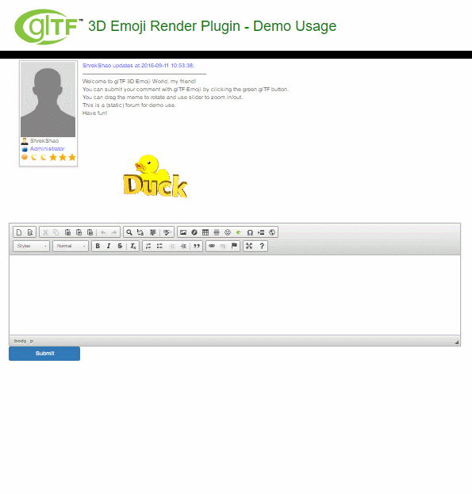

glTF Emoji renderer plugin
=====

glTF 3D Emoji Renderer plugin can render 3D interactive glTF Emoji in the browser canvas, 
which can add a lot of fun to your forum, blog, etc. Simply import the `build/glTFMeme.min.js` to use the renderer. 

[**A Live Forum Demo using glTF Emoji Renderer!**](https://shrekshao.github.io/gltf-emoji/src/renderer/a)

A PennApps Fall 2016 project!

## Member
* @shrekshao
* @AngryWatermelon
* @WindyDarin
* @ChuangLan

## Credit

* Three.js
* glTF Sample Models (Jackie Chan is a newly made model by us)
* CKeditor
* gulp